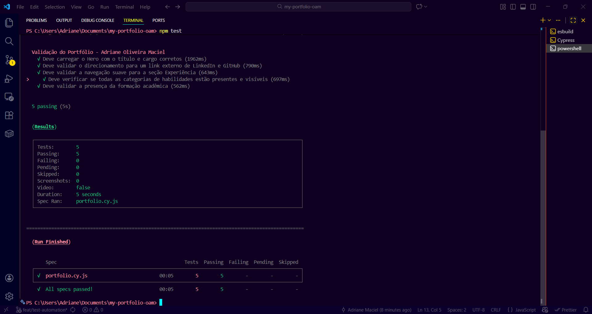
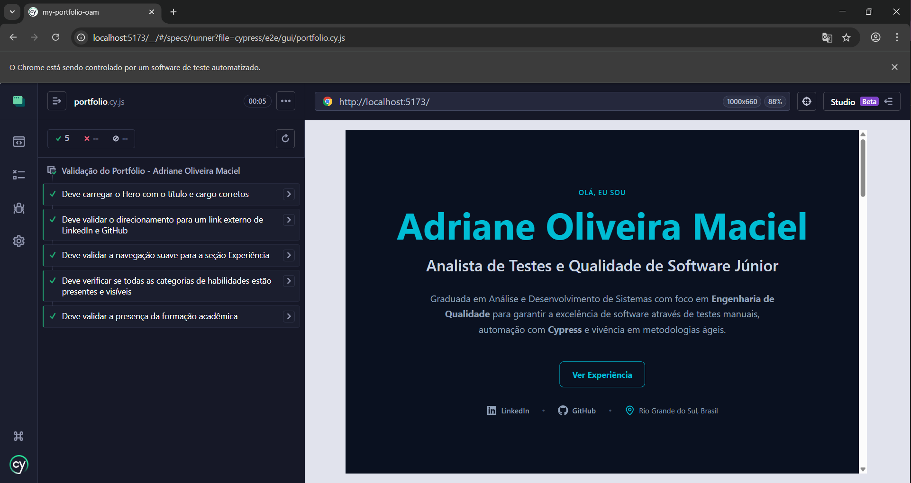

## 🚀 Adriane Oliveira Maciel | QA Engineer Portfolio

Desenvolvido com foco em demonstrar minhas competências em Engenharia de Qualidade de Software e Automação de Testes.

## 🛠️ Tecnologias e Ferramentas

- Desenvolvimento: React.js + Vite.

- Estilização: Tailwind CSS (Focado em design responsivo e Dark Mode).

- Ícones: Lucide React.

- Qualidade & Testes (Foco Principal): Cypress (Automação E2E).

## 🧪 Foco em QA (Quality Assurance)

Minha abordagem de desenvolvimento é guiada pelo STLC (Software Testing Life Cycle), garantindo que a qualidade não seja apenas uma etapa final, mas parte integrante do processo.

- Automação: Criação de scripts com Cypress para validação de fluxos de UI.

- Metodologias: Escrita de cenários em Gherkin/BDD.

## 🔧 Como rodar o projeto localmente

Clone o repositório:

```Bash
git clone https://github.com/adrianemaciel/qa-engineer-portfolio.git
```

Instale as dependências:

```Bash
npm install
```

Inicie o servidor de desenvolvimento:

```Bash
npm run dev
```

Executando os testes (Cypress):

- Modo Headless (Terminal)
  Ideal para integração contínua (CI/CD), executa todos os testes rapidamente sem abrir interface visual:

```Bash
npm test
```

- Modo Interativo (Interface Visual)
  Ideal para acompanhar a execução dos testes em tempo real e realizar debug:

```Bash
npm run test:open
```

### 📸 Evidências de Testes

Execução da suíte de testes (Smoke Tests) com todos os testes passando.

<details>
  <summary>Clique para ver as capturas de tela dos testes</summary>
  
  <br>
  <strong>Terminal:</strong><br>
  
  
  <br><br>
  <strong>Interface Visual:</strong><br>
  
</details>
